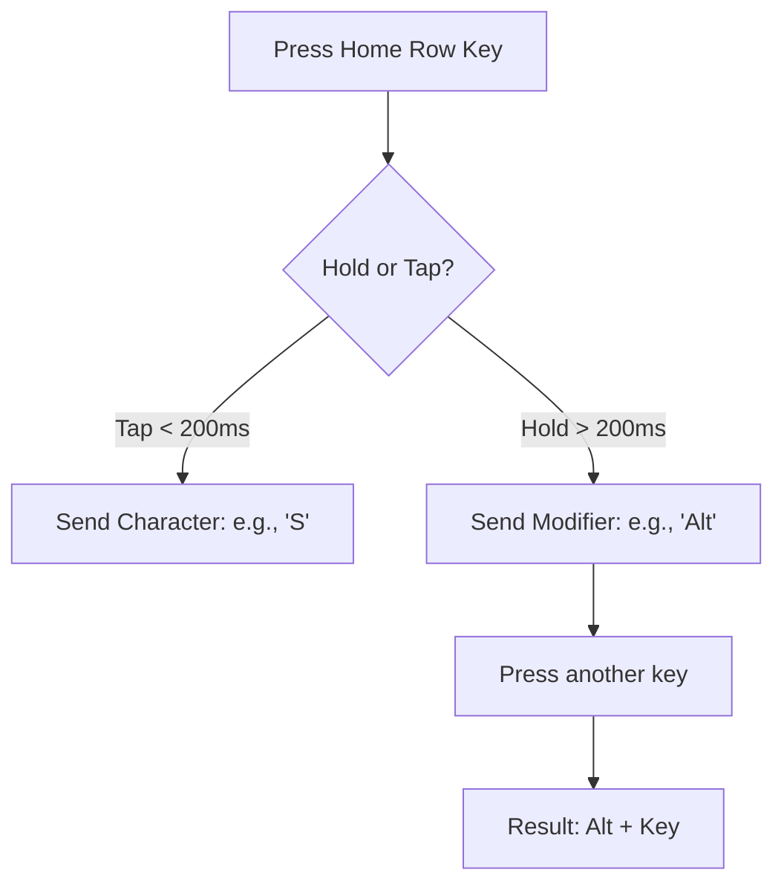
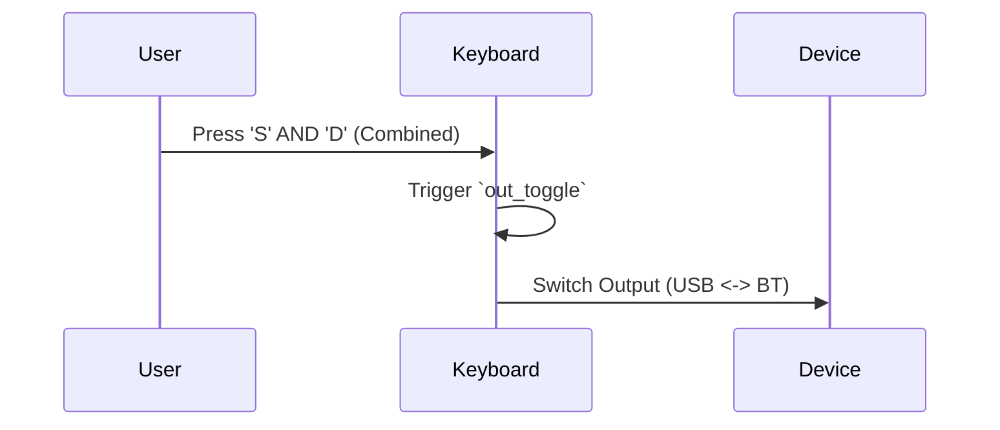
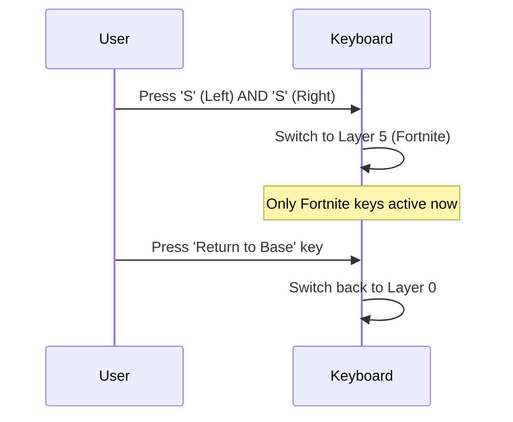
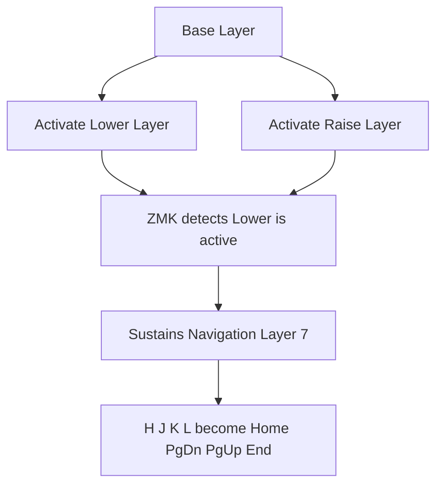

# ⌨️ Lily58 Ergonomic Overhaul Guide

This document explains the new architecture of your keyboard, including the symmetrical home row mods, the automatic navigation layer, and the rapid-switch combos.

## 🗺️ Visual Map (Base Layer)

### Left Hand
| ESC | 1 | 2 | 3 | 4 | 5 |
|---|---|---|---|---|---|
| TAB | Q | W | E | R | T |
| L-Shift | **GUI** (A) | **ALT** (S) | **SHIFT** (D) | **CTRL** (F) | G |
| L-Ctrl | Z | X | C | V | B |

### Right Hand
| 6 | 7 | 8 | 9 | 0 | Grave |
|---|---|---|---|---|---|
| Y | U | I | O | P | Backspace |
| **GUI** (H) | **ALT** (J) | **SHIFT** (K) | **CTRL** (L) | Semi | SQT |
| N | M | Comma | Dot | Slash | Equal |

---

## 🚀 Key Interactions & Shortcuts

### 1. Symmetrical Home Row Mods (The "Magic" Keys)
Your home row keys (`A S D F` and `H J K L`) now behave differently depending on whether you **tap** them or **hold** them.

**Logic Flow:**

*   **Example**: Hold `D` (Left hand) and tap `P` $\rightarrow$ `Shift + P`.
*   **Example**: Hold `L` (Right hand) and tap `S` $\rightarrow$ `Ctrl + S`.

### 2. Rapid USB $\leftrightarrow$ Bluetooth Toggle
You can now swap your connection instantly without entering any layers.

**Sequence:**

*   **Combo**: Press `S` and `D` (home row) simultaneously.

### 3. The "Jump to Fortnite" Combo
Instant switch to your gaming layout.

**Sequence:**

### 4. The Automatic Navigation Cluster (Conditional Layer)
You no longer need to map arrows and nav keys on every layer. They now "overlay" automatically.

**Trigger Logic:**

*   **How to use**: Hold your `Lower` or `Raise` thumb key. While holding it, your right hand's home row (`H J K L`) instantly becomes `Home`, `Page Down`, `Page Up`, and `End`.

---

## 🎬 Visual Action Sequences (The "GIF" Experience)

Since we can't play videos, follow these "frames" to understand the timing of your new features.

### 🔄 Sequence: USB $\leftrightarrow$ BT Swap
**[Frame 1]** 🖐️ Resting: Both hands on home row.
**[Frame 2]** 👆 Action: Left index finger on `S` and Left middle finger on `D`.
**[Frame 3]** 💥 Trigger: Press both `S` and `D` at the **same exact time**.
**[Frame 4]** ✨ Result: Connection swaps instantly. No menu, no flashing.

### 🎮 Sequence: Jump to Fortnite
**[Frame 1]** 🖐️ Resting: Base layer active.
**[Frame 2]** 👆 Action: Left middle finger on `S` $\rightarrow$ Right middle finger on `S`.
**[Frame 3]** 💥 Trigger: Squeeze both `S` keys simultaneously.
**[Frame 4]** 🚀 Result: You are now in Fortnite layer. Gaming keys are live.

### ⌨️ Sequence: The Symmetrical "Ctrl + S" (Save)
**[Frame 1]** 🖐️ Resting: Left hand on `A S D F` / Right hand on `H J K L`.
**[Frame 2]** 👆 Action: **Hold** the Right pinky/ring finger on `L` (The Ctrl mod).
**[Frame 3]** 👆 Action: While holding `L`, **Tap** the Left middle finger on `S`.
**[Frame 4]** ✅ Result: Computer receives `Ctrl + S`. No wrist stretching required.

---

## 🎓 Muscle Memory Training (The "7-Day Drill")

Symmetrical mods are powerful but feel "weird" for a few days. Use this drill for 5 minutes a day to master them.

### 📅 Days 1-2: The Left-Hand Confirmation
Practice only with your left hand. 
- Type `a s d f` as letters.
- Practice `Hold D` $\rightarrow$ `Tap P` (Shift + P).
- Practice `Hold F` $\rightarrow$ `Tap S` (Ctrl + S).

### 📅 Days 3-4: The Mirror Effect
Practice using only your right hand for modifiers.
- Type `h j k l` as letters.
- Practice `Hold K` $\rightarrow$ `Tap A` (Shift + A).
- Practice `Hold L` $\rightarrow$ `Tap S` (Ctrl + S).

### 📅 Days 5-7: Cross-Hand Coordination
The "Pro" stage. Never use a modifier from the same hand as the key.
- **Right Mod $\rightarrow$ Left Key**: Hold `L` (Right Ctrl) $\rightarrow$ Tap `A`.
- **Left Mod $\rightarrow$ Right Key**: Hold `F` (Left Ctrl) $\rightarrow$ Tap `P`.

---

## ⚙️ Technical Maintenance Summary

| Feature | Setting | Value | Effect |
| :--- | :--- | :--- | :--- |
| **BT Stability** | `IDLE_TIMEOUT` | `900000` | Reduces disconnects |
| **BT Power** | `TX_PWR_PLUS_8` | `y` | Stronger signal |
| **Repeat Fix** | `tapping-term` | `200ms` | Faster "aaaa" repeats |
| **Space Key** | Behavior | `&kp SPACE` | Removed tmux hold-tap for speed |
